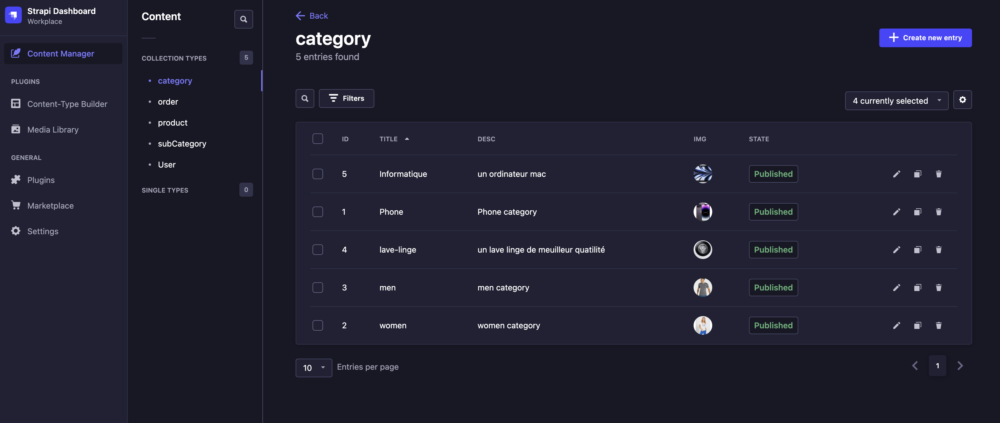
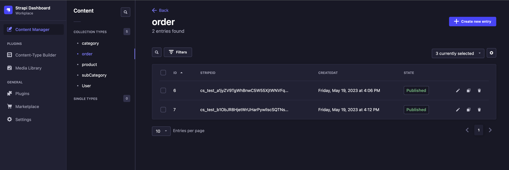
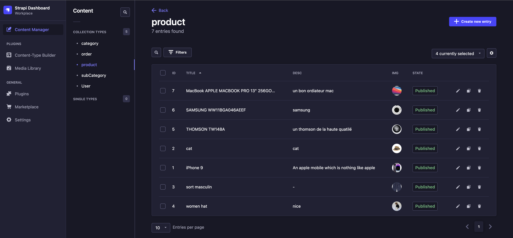
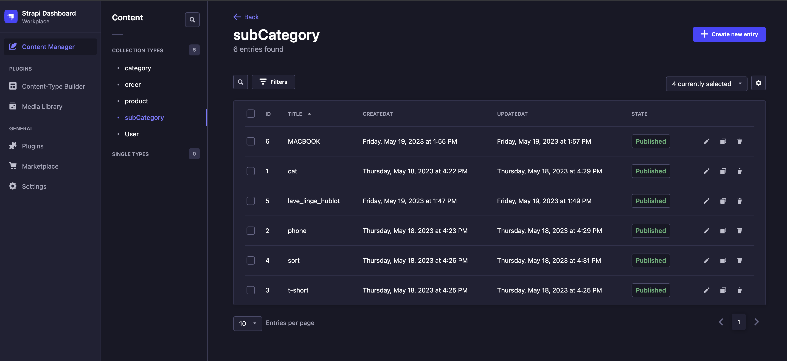
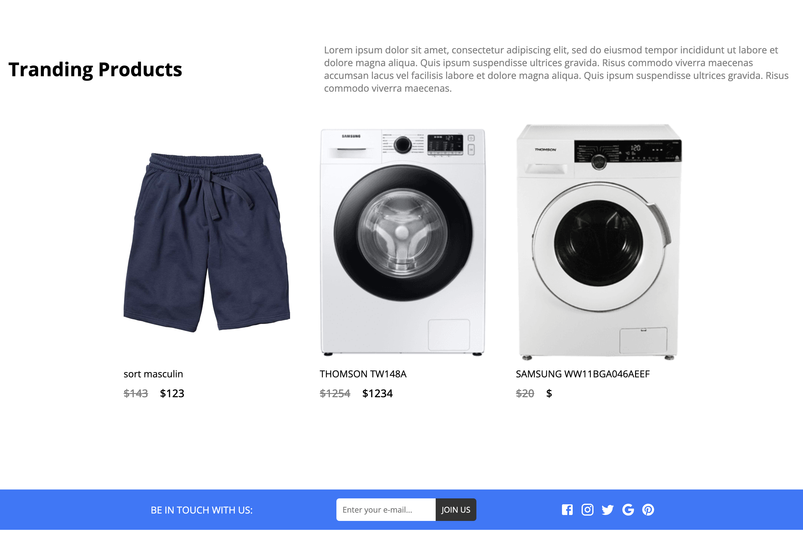
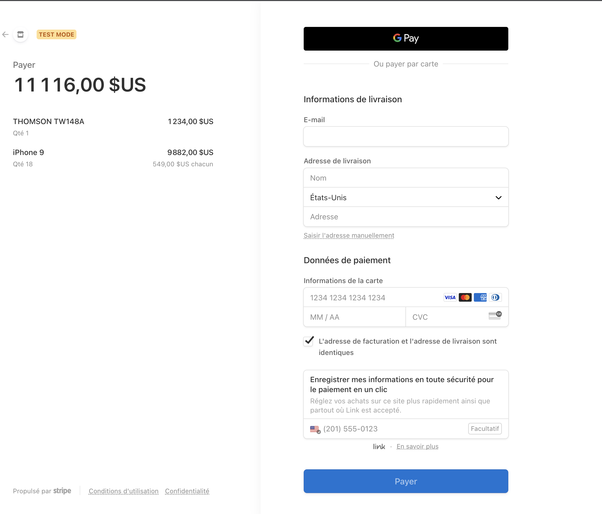

# Complete E-Commerce App with React, Strapi, Stripe | Shopping App 

# In this app you will 

🏆 React Router Dom v6.4 Tutorial
🏆 React Slider Tutorial (without any library)
🏆 Grid System Using CSS Flexbox
🏆 React Strapi E-commerce App (Connection)
🏆 React Strapi E-commerce App (Fetching Items)
🏆 React Strapi Rest Api Filtering Tutorial
🏆 React Redux Shopping Cart Tutorial
🏆 React Redux Toolkit How to Persist State
🏆 Strapi Stripe Payment Using a React App

💻 Screen Shot Backend:  Strapi  💻

💻 Screen Shot Front:  React  💻

